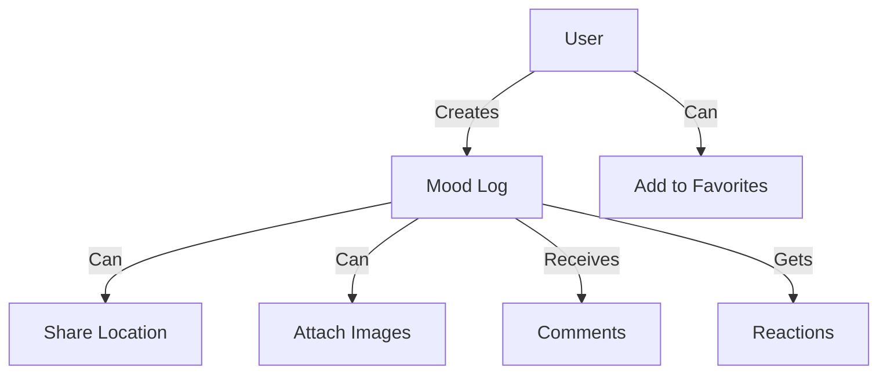
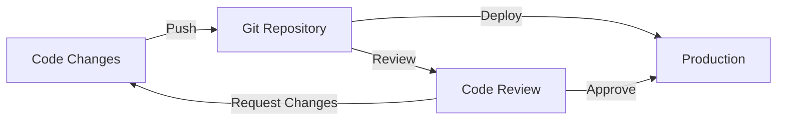
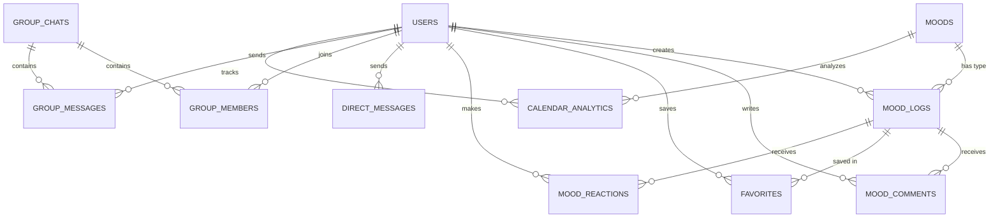
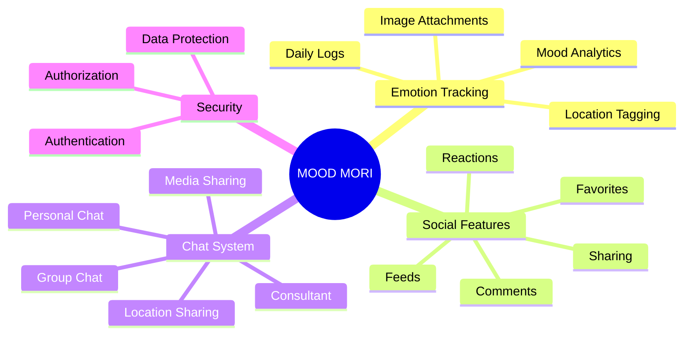

<div align="center">

# 🌈 MOOD MORI

### Share Your Emotional Journey, Connect with Others


</div>

## 🚀 Tech Stack

### 🎨 Frontend
```javascript
const frontendStack = {
  framework: "React v19",
  bundler: "Vite",
  styling: "TailwindCSS",
  routing: "React Router DOM v7",
  icons: "React Icons v5",
  networking: "Axios v1.9"
}
```

### ⚙️ Backend
```javascript
const backendStack = {
  runtime: "Node.js",
  framework: "Express v4.21",
  database: "PostgreSQL",
  storage: "Cloudinary",
  security: {
    authentication: "bcrypt",
    sessions: "express-session"
  },
  uploads: "Multer"
}
```

## 💫 What is MOOD MORI?

MOOD MORI is a social-based Emotion Log platform that helps users track and share their emotional journey. The application combines personal mood tracking with social features to create a supportive environment for emotional well-being.

## 👥 Team Members

| Role | Name | Student ID |
|------|------|------------|
| Fullstack Lead | Andi Muhammad Alvin Farhansyah | 2306161933 |
| UI/UX Designer  | Aliya Rizqiningrum Salamun | 2306161813 |
| UI/UX Designer  | Raka Arrayan Muttaqien | 2306161800 |
| UI/UX Designer | Filaga Tifira Muthi | 2306208445 |

## ✨ Key Features

### 🎯 Core Features
- **Emotion Logging**: Track and monitor your emotional state
- **Rich Dashboard**: Visual representation of mood patterns
- **Secure Auth**: Protected routes and session management

### 💬 Social Features


### 💭 Chat System
- Personal chat with image sharing
- Group chat functionality
- Real-time location sharing

## Project Structure

```
├── backend/
│   ├── src/
│   │   ├── controllers/     # Request handlers
│   │   ├── repositories/    # Database queries
│   │   ├── routes/         # API routes
│   │   ├── utils/          # Helper functions
│   │   └── database/       # Database connection
│   └── index.js            # Entry point
└── frontend/
    ├── src/
    │   ├── api/            # API configurations
    │   ├── components/     # Reusable UI components
    │   ├── pages/          # Application views
    │   └── assets/         # Static resources
    └── index.html
```

## 🛠️ Quick Start

[](https://nodejs.org)
[](https://www.postgresql.org)
[](https://www.npmjs.com)

### 📋 Prerequisites
- Node.js
- PostgreSQL
- npm or yarn

### 🔧 Installation

#### Backend Setup
```bash
# Clone repository
git clone <repository-url>

# Navigate to backend
cd backend

# Install dependencies
npm install

# Set up environment variables
cp .env.example .env
# Edit .env with your configurations

# Start development server
npm run dev
```

#### Frontend Setup
```bash
# Navigate to frontend
cd frontend

# Install dependencies
npm install

# Start development server
npm run dev
```

### 🌐 Development Workflow



### 🎮 Available Scripts

#### Backend
```bash
npm run dev      # Start development server
npm start        # Start production server
```

#### Frontend
```bash
npm run dev      # Start development server
npm run build    # Build for production
npm run preview  # Preview production build
```

## 📊 Database Architecture

### 🔄 Entity Relationship Diagram



### Core Entities

#### Users
```sql
CREATE TABLE users (
    id SERIAL PRIMARY KEY,
    username VARCHAR(50) UNIQUE NOT NULL,
    email VARCHAR(100) UNIQUE NOT NULL,
    password_hash TEXT NOT NULL,
    profile_picture TEXT,
    location TEXT,
    created_at TIMESTAMP DEFAULT CURRENT_TIMESTAMP
);
```

#### Moods
```sql
CREATE TABLE moods (
    id SERIAL PRIMARY KEY,
    mood_name VARCHAR(30) UNIQUE NOT NULL,
    icon TEXT,
    color VARCHAR(10)
);
```

Predefined moods with their visual representations:
| Mood Name  | Icon | Color   |
|------------|------|---------|
| HAPPY      | 😊   | #FFD700 |
| SAD        | 😢   | #6495ED |
| ANGRY      | 😠   | #FF4500 |
| AFRAID     | 😨   | #9370DB |
| NEUTRAL    | 😐   | #A9A9A9 |
| MANIC      | 😆   | #FF1493 |
| DEPRESSED  | 😞   | #4682B4 |
| FURIOUS    | 😡   | #DC143C |
| TERRIFIED  | 😱   | #800080 |
| CALM       | 😌   | #20B2AA |

#### Mood Logs
```sql
CREATE TABLE mood_logs (
    id SERIAL PRIMARY KEY,
    user_id INTEGER REFERENCES users(id),
    mood_id INTEGER REFERENCES moods(id),
    note TEXT,
    location TEXT,
    image_url TEXT,
    is_public BOOLEAN DEFAULT FALSE,
    log_date DATE DEFAULT CURRENT_DATE,
    created_at TIMESTAMP DEFAULT CURRENT_TIMESTAMP
);
```

### Social Features

#### Mood Comments
```sql
CREATE TABLE mood_comments (
    id SERIAL PRIMARY KEY,
    mood_log_id INTEGER REFERENCES mood_logs(id),
    user_id INTEGER REFERENCES users(id),
    content TEXT NOT NULL,
    created_at TIMESTAMP DEFAULT CURRENT_TIMESTAMP
);
```

#### Favorites
```sql
CREATE TABLE favorites (
    id SERIAL PRIMARY KEY,
    user_id INTEGER REFERENCES users(id),
    mood_log_id INTEGER REFERENCES mood_logs(id),
    created_at TIMESTAMP DEFAULT CURRENT_TIMESTAMP
);
```

#### Mood Reactions
```sql
CREATE TABLE mood_reactions (
    id SERIAL PRIMARY KEY,
    mood_log_id INTEGER REFERENCES mood_logs(id),
    user_id INTEGER REFERENCES users(id),
    is_like BOOLEAN NOT NULL,
    created_at TIMESTAMP DEFAULT CURRENT_TIMESTAMP
);
```

### Chat System

#### Direct Messages
```sql
CREATE TABLE direct_messages (
    id SERIAL PRIMARY KEY,
    sender_id INTEGER REFERENCES users(id),
    recipient_id INTEGER REFERENCES users(id),
    content TEXT NOT NULL,
    location TEXT,
    is_read BOOLEAN DEFAULT FALSE,
    created_at TIMESTAMP DEFAULT CURRENT_TIMESTAMP
);
```

#### Group Chats
```sql
CREATE TABLE group_chats (
    id SERIAL PRIMARY KEY,
    name VARCHAR(100) NOT NULL,
    creator_id INTEGER REFERENCES users(id),
    description TEXT,
    created_at TIMESTAMP DEFAULT CURRENT_TIMESTAMP
);
```

#### Group Members
```sql
CREATE TABLE group_members (
    id SERIAL PRIMARY KEY,
    group_id INTEGER REFERENCES group_chats(id),
    user_id INTEGER REFERENCES users(id),
    joined_at TIMESTAMP DEFAULT CURRENT_TIMESTAMP
);
```

#### Group Messages
```sql
CREATE TABLE group_messages (
    id SERIAL PRIMARY KEY,
    group_id INTEGER REFERENCES group_chats(id),
    sender_id INTEGER REFERENCES users(id),
    content TEXT NOT NULL,
    created_at TIMESTAMP DEFAULT CURRENT_TIMESTAMP
);
```

### Analytics

#### Calendar Analytics
```sql
CREATE TABLE calendar_analytics (
    id SERIAL PRIMARY KEY,
    user_id INTEGER REFERENCES users(id),
    mood_id INTEGER REFERENCES moods(id),
    mood_date DATE,
    mood_count INTEGER DEFAULT 1
);
```

## Database Optimization
The database is optimized with indexes on frequently accessed columns:
- Mood logs: user_id, mood_id, is_public, log_date
- Reactions: mood_log_id, user_id
- Messages: sender_id, recipient_id
- Group messages: group_id
- Favorites: user_id, mood_log_id
- Comments: mood_log_id, user_id

## Features Overview

### Emotion Logging
- Create and track daily mood entries
- Add context and notes to mood logs
- View historical mood patterns
- Add images to mood entries

### Chat System
- Real-time personal and group messaging
- Image sharing in chats
- Location sharing capabilities
- Group chat management features

### Social Features
- Create and join groups
- Add posts to favorites
- Comment on mood logs
- User profile customization

### Security Features
- Secure authentication
- Protected routes
- Session management
- File upload validation

## 🔐 Environment Variables

### Backend (.env)
```bash
# Server Configuration
PORT=3000
NODE_ENV=development

# Database Configuration
DB_HOST=localhost
DB_PORT=5432
DB_NAME=mood_mori_db
DB_USER=your_username
DB_PASSWORD=your_password

# Authentication
JWT_SECRET=your_jwt_secret
SESSION_SECRET=your_session_secret

# Cloudinary Configuration
CLOUDINARY_CLOUD_NAME=your_cloud_name
CLOUDINARY_API_KEY=your_api_key
CLOUDINARY_API_SECRET=your_api_secret
```

### Frontend (.env)
```bash
VITE_API_URL=http://localhost:3000
VITE_CLOUDINARY_URL=your_cloudinary_url
```

## 📱 Application Features



## 🤝 Contributing

1. Fork the repository
2. Create your feature branch
   ```bash
   git checkout -b feature/AmazingFeature
   ```
3. Commit your changes
   ```bash
   git commit -m 'Add some AmazingFeature'
   ```
4. Push to the branch
   ```bash
   git push origin feature/AmazingFeature
   ```
5. Open a Pull Request

---
<div align="center">
Made with 💖 by Team MOOD MORI
</div>
