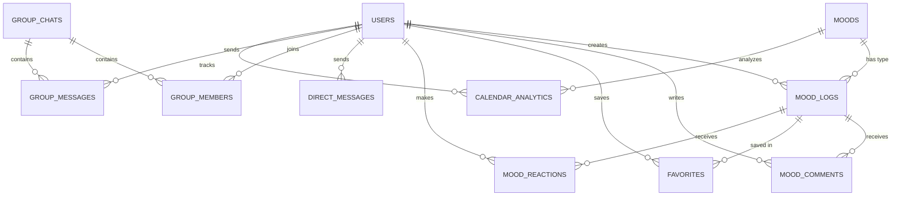

# MOOD MORI

MOOD MORI is a social-based Emotion Log platform that helps users track and share their emotional journey. The application features a comprehensive chat system, group functionality, and location/image sharing capabilities.

## Team Members

- Andi Muhammad Alvin Farhansyah (2306161933)
- Aliya Rizqiningrum Salamun (2306161813)
- Raka Arrayan Muttaqien (2306161800)
- Filaga Tifira Muthi (2306208445)

## Features

- **Emotion Logging**: Track and monitor your emotional state
- **Chat System**:
  - Personal chat functionality
  - Group chat support
  - Image sharing capabilities
  - Location sharing
- **Social Features**:
  - User profiles
  - Group system
  - Favorites system
  - Comments and interactions
- **Dashboard**: Visual representation of mood patterns and statistics
- **Authentication**: Secure user registration and login system

## Tech Stack

### Frontend
- React (v19)
- Vite
- TailwindCSS
- React Router DOM
- React Icons
- Axios for API calls

### Backend
- Node.js with Express
- PostgreSQL database
- Cloudinary for image storage
- Authentication with bcrypt
- Session management
- Multer for file uploads

## Project Structure

```
├── backend/
│   ├── src/
│   │   ├── controllers/     # Request handlers
│   │   ├── repositories/    # Database queries
│   │   ├── routes/         # API routes
│   │   ├── utils/          # Helper functions
│   │   └── database/       # Database connection
│   └── index.js            # Entry point
└── frontend/
    ├── src/
    │   ├── api/            # API configurations
    │   ├── components/     # Reusable UI components
    │   ├── pages/          # Application views
    │   └── assets/         # Static resources
    └── index.html
```

## Setup Instructions

### Prerequisites
- Node.js
- PostgreSQL
- npm or yarn

### Backend Setup
1. Navigate to the backend directory:
   ```bash
   cd backend
   ```
2. Install dependencies:
   ```bash
   npm install
   ```
3. Create a .env file with necessary configurations
4. Start the development server:
   ```bash
   npm run dev
   ```

### Frontend Setup
1. Navigate to the frontend directory:
   ```bash
   cd frontend
   ```
2. Install dependencies:
   ```bash
   npm install
   ```
3. Start the development server:
   ```bash
   npm run dev
   ```

## Database Schema

### Entity Relationship Diagram



### Core Entities

#### Users
```sql
CREATE TABLE users (
    id SERIAL PRIMARY KEY,
    username VARCHAR(50) UNIQUE NOT NULL,
    email VARCHAR(100) UNIQUE NOT NULL,
    password_hash TEXT NOT NULL,
    profile_picture TEXT,
    location TEXT,
    created_at TIMESTAMP DEFAULT CURRENT_TIMESTAMP
);
```

#### Moods
```sql
CREATE TABLE moods (
    id SERIAL PRIMARY KEY,
    mood_name VARCHAR(30) UNIQUE NOT NULL,
    icon TEXT,
    color VARCHAR(10)
);
```

Predefined moods with their visual representations:
| Mood Name  | Icon | Color   |
|------------|------|---------|
| HAPPY      | 😊   | #FFD700 |
| SAD        | 😢   | #6495ED |
| ANGRY      | 😠   | #FF4500 |
| AFRAID     | 😨   | #9370DB |
| NEUTRAL    | 😐   | #A9A9A9 |
| MANIC      | 😆   | #FF1493 |
| DEPRESSED  | 😞   | #4682B4 |
| FURIOUS    | 😡   | #DC143C |
| TERRIFIED  | 😱   | #800080 |
| CALM       | 😌   | #20B2AA |

#### Mood Logs
```sql
CREATE TABLE mood_logs (
    id SERIAL PRIMARY KEY,
    user_id INTEGER REFERENCES users(id),
    mood_id INTEGER REFERENCES moods(id),
    note TEXT,
    location TEXT,
    image_url TEXT,
    is_public BOOLEAN DEFAULT FALSE,
    log_date DATE DEFAULT CURRENT_DATE,
    created_at TIMESTAMP DEFAULT CURRENT_TIMESTAMP
);
```

### Social Features

#### Mood Comments
```sql
CREATE TABLE mood_comments (
    id SERIAL PRIMARY KEY,
    mood_log_id INTEGER REFERENCES mood_logs(id),
    user_id INTEGER REFERENCES users(id),
    content TEXT NOT NULL,
    created_at TIMESTAMP DEFAULT CURRENT_TIMESTAMP
);
```

#### Favorites
```sql
CREATE TABLE favorites (
    id SERIAL PRIMARY KEY,
    user_id INTEGER REFERENCES users(id),
    mood_log_id INTEGER REFERENCES mood_logs(id),
    created_at TIMESTAMP DEFAULT CURRENT_TIMESTAMP
);
```

#### Mood Reactions
```sql
CREATE TABLE mood_reactions (
    id SERIAL PRIMARY KEY,
    mood_log_id INTEGER REFERENCES mood_logs(id),
    user_id INTEGER REFERENCES users(id),
    is_like BOOLEAN NOT NULL,
    created_at TIMESTAMP DEFAULT CURRENT_TIMESTAMP
);
```

### Chat System

#### Direct Messages
```sql
CREATE TABLE direct_messages (
    id SERIAL PRIMARY KEY,
    sender_id INTEGER REFERENCES users(id),
    recipient_id INTEGER REFERENCES users(id),
    content TEXT NOT NULL,
    location TEXT,
    is_read BOOLEAN DEFAULT FALSE,
    created_at TIMESTAMP DEFAULT CURRENT_TIMESTAMP
);
```

#### Group Chats
```sql
CREATE TABLE group_chats (
    id SERIAL PRIMARY KEY,
    name VARCHAR(100) NOT NULL,
    creator_id INTEGER REFERENCES users(id),
    description TEXT,
    created_at TIMESTAMP DEFAULT CURRENT_TIMESTAMP
);
```

#### Group Members
```sql
CREATE TABLE group_members (
    id SERIAL PRIMARY KEY,
    group_id INTEGER REFERENCES group_chats(id),
    user_id INTEGER REFERENCES users(id),
    joined_at TIMESTAMP DEFAULT CURRENT_TIMESTAMP
);
```

#### Group Messages
```sql
CREATE TABLE group_messages (
    id SERIAL PRIMARY KEY,
    group_id INTEGER REFERENCES group_chats(id),
    sender_id INTEGER REFERENCES users(id),
    content TEXT NOT NULL,
    created_at TIMESTAMP DEFAULT CURRENT_TIMESTAMP
);
```

### Analytics

#### Calendar Analytics
```sql
CREATE TABLE calendar_analytics (
    id SERIAL PRIMARY KEY,
    user_id INTEGER REFERENCES users(id),
    mood_id INTEGER REFERENCES moods(id),
    mood_date DATE,
    mood_count INTEGER DEFAULT 1
);
```

## Database Optimization
The database is optimized with indexes on frequently accessed columns:
- Mood logs: user_id, mood_id, is_public, log_date
- Reactions: mood_log_id, user_id
- Messages: sender_id, recipient_id
- Group messages: group_id
- Favorites: user_id, mood_log_id
- Comments: mood_log_id, user_id

## Features Overview

### Emotion Logging
- Create and track daily mood entries
- Add context and notes to mood logs
- View historical mood patterns
- Add images to mood entries

### Chat System
- Real-time personal and group messaging
- Image sharing in chats
- Location sharing capabilities
- Group chat management features

### Social Features
- Create and join groups
- Add posts to favorites
- Comment on mood logs
- User profile customization

### Security Features
- Secure authentication
- Protected routes
- Session management
- File upload validation
